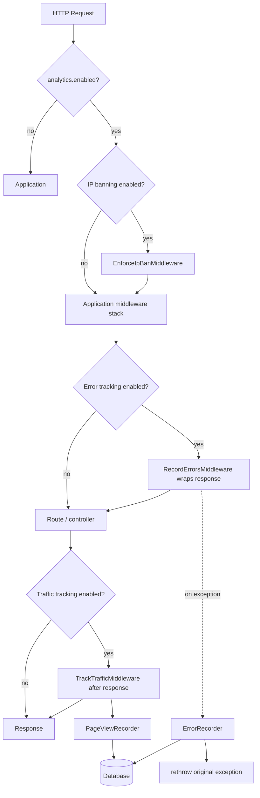

# Architecture

Laravel Analytics is a Laravel package composed of middleware, services, Eloquent models, optional Livewire dashboard components, and Artisan commands. The analytics engine is usable without the dashboard UI.

## Package boot

1. Composer autoloads `SimbaJirira\LaravelAnalytics\AnalyticsServiceProvider`.
2. The provider merges `config/analytics.php`, registers singleton services, and binds contracts.
3. On boot it loads routes (`routes/web.php`, `routes/dashboard.php`), views (`analytics` namespace), translations, and Livewire components when Livewire is bound.
4. Middleware aliases are registered; selected middleware is attached to the `web` group when config enables features.
5. Console commands and publishable assets register only in the console.

## Request tracking pipeline



### Exclusions

`RequestExclusionChecker` skips tracking when:

- the master switch is off;
- the path, route name, or HTTP method matches `analytics.ignored`;
- the response status is listed in `excluded_status_codes` (traffic only);
- feature-specific rules apply (for example dashboard self-tracking defaults).

## Visitor identification

1. `TrackTrafficMiddleware` receives the response.
2. `PageViewRecorder` resolves or creates a visitor via `VisitorService`.
3. `VisitorIdentifier` (default: `DefaultVisitorIdentifier`) produces a `visitor_hash`.
4. A page view row is persisted with request/response metadata.

See [VISITOR_IDENTIFICATION.md](VISITOR_IDENTIFICATION.md).

## Data model

| Model | Table | Role |
|-------|-------|------|
| `Visitor` | `analytics_visitors` | Unique visitor aggregate |
| `PageView` | `analytics_page_views` | Individual page views |
| `AnalyticsError` | `analytics_errors` | Grouped error occurrences |
| `IpBan` | `analytics_ip_bans` | Exact IP ban records |

Relationships:

- `PageView` belongs to `Visitor` (nullable `visitor_id`, always has `visitor_hash`)
- Models use package factories for tests

## Error recording

1. `RecordErrorsMiddleware` wraps the downstream pipeline in try/catch.
2. On `Throwable`, `ErrorRecorder::record()` is invoked inside a nested try/catch.
3. `AnalyticsErrorRecorder` extracts safe metadata, generates a fingerprint, and upserts `analytics_errors`.
4. The original exception is always rethrown.
5. Failures inside the recorder are swallowed.

Replace via `analytics.error_recorder` config binding.

## IP ban enforcement

1. `EnforceIpBanMiddleware` resolves the client IP using Laravel's request IP (respecting trusted proxies configured in the host app).
2. `IpBanService` checks for an active, non-expired ban on the exact address.
3. Matching bans return the configured status (default 403).

Ban/unban mutations go through `IpBanService` / `IpUnbanService` (dashboard or CLI).

## Dashboard query path

1. Routes in `routes/dashboard.php` register when dashboard config is valid.
2. `AuthorizeAnalyticsDashboard` delegates to `DashboardAuthorizer`.
3. Livewire components use `InteractsWithAnalyticsDashboard` for date range resolution.
4. `AnalyticsDashboardQuery` runs aggregate SQL for KPIs, trends, rankings, errors, and bans.
5. Results render through Blade views in the `analytics::` namespace.

The dashboard layout is package-owned (`analytics::layouts.dashboard`) and publishable.

## Retention / pruning

`AnalyticsPruner` deletes or deactivates records older than the configured cutoff:

- page views by `viewed_at`
- visitors by `last_seen_at` when no retained page views remain
- errors by `last_occurred_at`
- expired IP bans deactivated, then old ban rows removed

Invoked by `analytics:prune`. Not scheduled by the package.

## Extension contracts

Stable extension points:

| Contract | Default implementation | Purpose |
|----------|------------------------|---------|
| `VisitorIdentifier` | `DefaultVisitorIdentifier` | Visitor hash generation |
| `AnalyticsRecorder` | `PageViewRecorder` | Page view persistence (aliased in container) |
| `ErrorRecorder` | `AnalyticsErrorRecorder` | HTTP error persistence |

Internal services (`VisitorService`, `AnalyticsDashboardQuery`, middleware classes, etc.) are implementation details unless documented otherwise.

## Security boundaries

| Boundary | Mechanism |
|----------|-----------|
| Dashboard access | Config + gate / invokable authorization; deny by default |
| IP banning | Opt-in; exact-match only |
| Sensitive error data | `SafeExceptionMetadataExtractor` redaction |
| Recorder failure | Does not replace application exceptions |
| Self-tracking | Dashboard paths ignored by default |
| Proxy trust | Host application trusted proxy configuration |

## Directory map

```text
src/
├── Console/Commands/     Artisan commands
├── Contracts/            VisitorIdentifier, AnalyticsRecorder, ErrorRecorder
├── Http/Middleware/      Tracking, errors, bans, dashboard auth
├── Livewire/             Optional dashboard components
├── Models/               Eloquent models
├── Services/             Recorders, pruner, dashboard query, IP ban services
└── Support/              Authorizer, identifiers, normalizers, extractors
```

## Related documentation

- [CONFIGURATION.md](CONFIGURATION.md)
- [DASHBOARD.md](DASHBOARD.md)
- [PRIVACY.md](PRIVACY.md)
